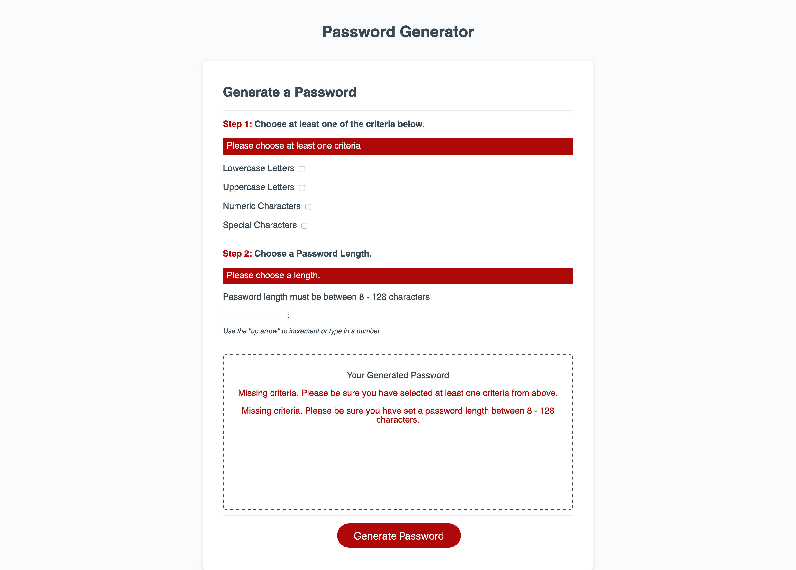
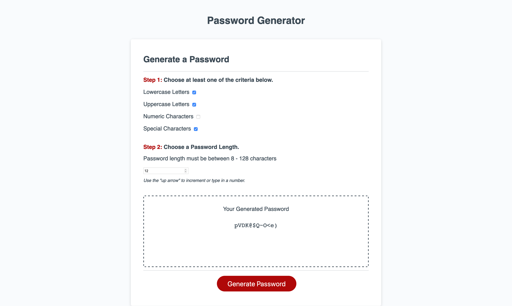

# Password Generator

## Get the Password Generator Source Files
* Clone the repo OR
* Download as .zip file

## How the Password Generator Works
1. A user sets the criteria for their password by selecting the associated checkbox
    1. The user must choose at least one of the following criteria
    1. Lowercase letters
    1. Uppercase letters
    1. Numbers
    1. Special characters
1. A user then chooses a password length
    1. The length can be between 8 to 128 characters
1. To generate the password with the desired length and criteria, click the 'Generate Password' button
    1. Note: If the criteria and/or length is not selected by the user, when the generate button is clicked, it will display error messaging depending on what the user has left blank

## Go to the Password Generator
Follow this link to [go to the password generator](https://hughesthatgirl.github.io/00_homework-3/index.html). 

## Preview of what the password generator should look like
;

## The password generator will display the appropriate error messaging based on missing criteria
;

## The password generator with password displayed
;