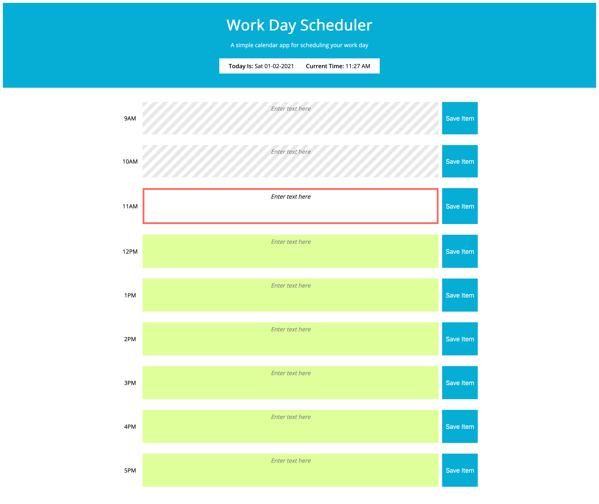

# Work Day Scheduler

## Get the Work Day Scheduler Source Files
* Clone the repo OR
* Download as .zip file

## How the Work Day Scheduler works
1. On page load, the current date and time should be displayed
1. The time blocks will be color coded as occurring in the past, future or present relative to the current time
1. Each time block is a text input; When a user types in a value and clicks the 'save item' button, that value will be saved to local storage

## Go to the Work Day Scheduler
Follow this link to [go to the Work Day scheduler](https://hughesthatgirl.github.io/joanna-work-samples/05_weekday_scheduler/index.html). 

## Preview of what the Work Day Scheduler should look like
;